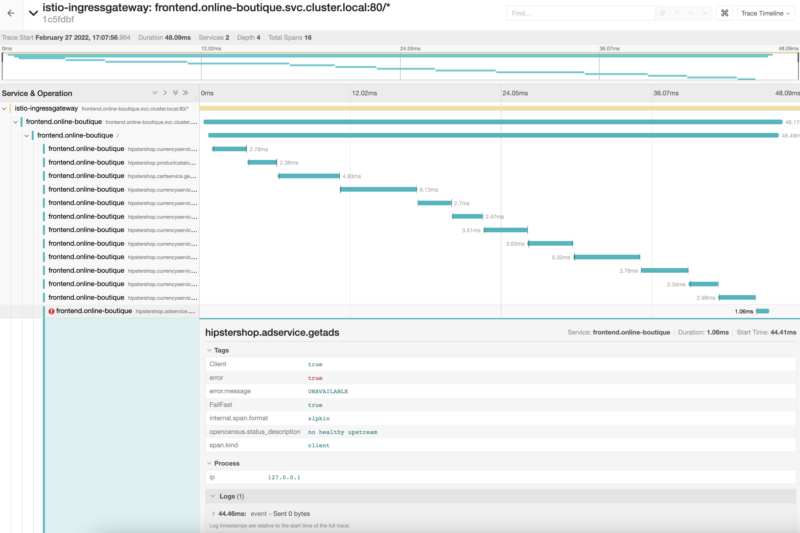

# Deliverable 5

```bash
>kapp get deploy adservice
NAME        READY   UP-TO-DATE   AVAILABLE   AGE
adservice   1/1     1            1           28d

# Scale adservice deployment to 0
>kapp scale --replicas=0 deploy/adservice
deployment.apps/adservice scaled

>kapp get deploy adservice
NAME        READY   UP-TO-DATE   AVAILABLE   AGE
adservice   0/0     0            0           28d

# Generate traffic
for i in {1..5}; do curl -sS http://$INGRESS -w "%{time_total}" -o /dev/null; echo;done

0.062358
0.046635
0.041604
0.046507
0.055266
```

### Trace error with Adservice scaled to 0 replicas


